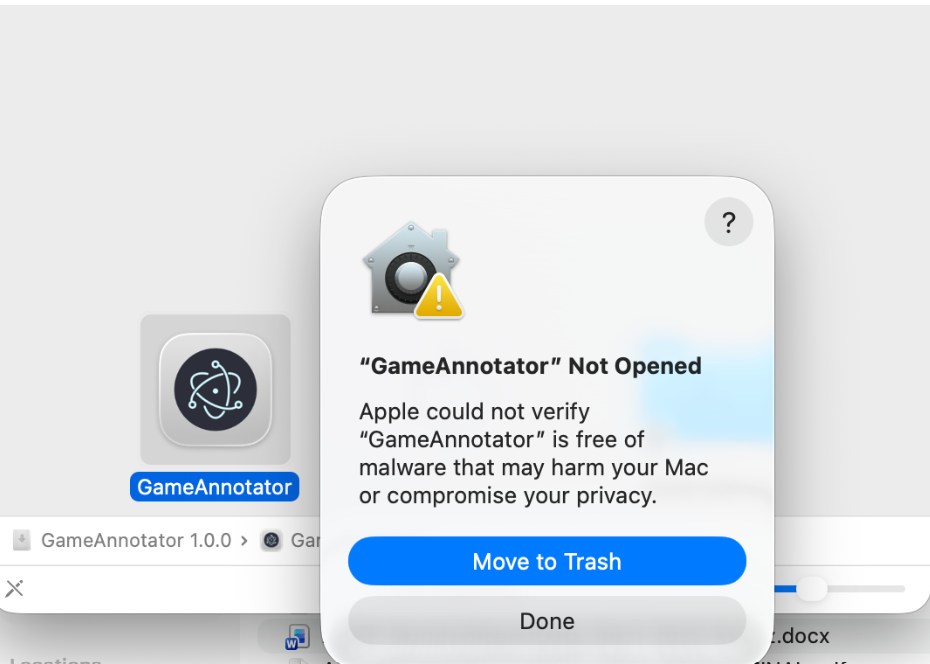
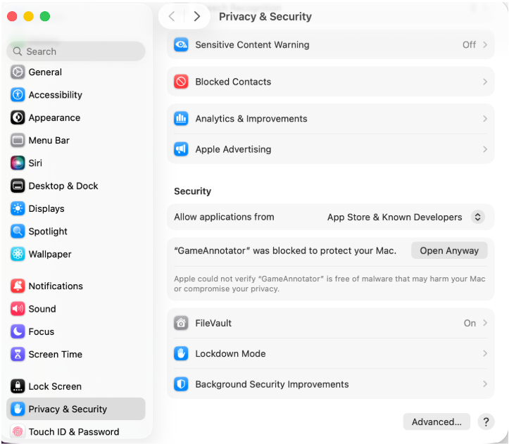

# Installing SavePoint

These are participant facing instructions for getting SavePoint onto your
machine. They assume your researcher has already built a version of the app for
the study and sent it to you.

If you are the researcher preparing that build, see
[Building SavePoint for a study](build-the-app.md) and
[Distributing to participants](distribute-to-participants.md) instead.

Your researcher will have sent you an installer — a file ending in `.exe` on
Windows, or `.dmg` / `.zip` on Mac. Follow the steps for your machine:
[Windows](#windows) or [Mac](#mac).

Your study records your screen in one of two ways, and your researcher will
have told you which:

- **OBS** — a separate app you need to install and configure. Do this after
  installing SavePoint, following [Setting up OBS](configure-obs.md).
- **The built-in recorder** — nothing extra to install; it comes with the app.

---

## Windows

1. **Download the installer** your researcher sent you — a file named something
   like `SavePoint Setup 1.0.0.exe`.
2. **Double-click it to run.**
3. **If Windows SmartScreen blocks it,** you'll see a blue "Windows protected
   your PC" dialog. This is expected: the app isn't signed by a commercial
   publisher, which is not the same as there being something wrong with it. Click
   **More info**, then **Run anyway**.
4. Follow the installer prompts. When it finishes, SavePoint appears in your
   Start menu.
5. **Open SavePoint** to confirm it launches. It will ask for a username — stop
   there and read [Using SavePoint](using-the-app.md) before starting your first
   real session.

There is also a walkthrough video for Windows:
[WindowsTutorial-part1.mp4](videos/WindowsTutorial-part1.mp4).

## Mac

1. **Download the `.dmg`** (or `.zip`) your researcher sent you.
2. **Open the `.dmg`** and drag **SavePoint** into your **Applications** folder.
   If you were sent a `.zip`, unzip it and move the SavePoint app into
   **Applications** yourself.
3. **Open SavePoint from Applications.** The first launch will most likely be
   blocked — see the next section.
4. **Allow screen recording.** macOS asks for permission the first time
   something tries to capture your screen. Go to **System Settings > Privacy &
   Security > Screen & System Audio Recording** and make sure SavePoint is
   enabled. If you are recording through OBS, OBS needs this permission too,
   which is covered in [Setting up OBS](configure-obs.md).

### If macOS blocks the app

Your Mac may refuse to open SavePoint because it cannot verify it:

This is expected, and you can fix it. Go to **System Settings > Privacy &
Security** and scroll to the **Security** section:

Click **Open Anyway** and the app should work. You can also look at this [YouTube tutorial](https://www.youtube.com/watch?v=biIvAM94b98) if you're confused. 

---

## You're ready

Next, set up [OBS](configure-obs.md) if your study uses it, then see
[Using SavePoint](using-the-app.md) for how to run a session.

If you have any questions, please reach out.
