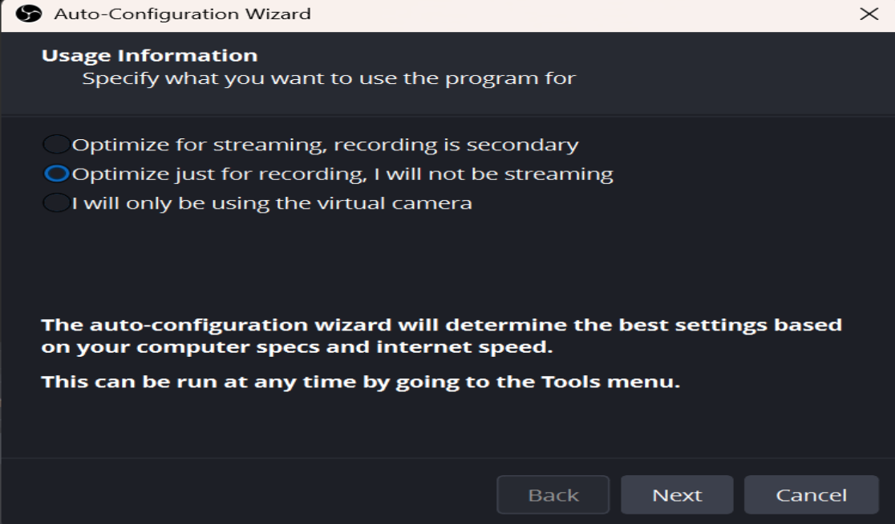
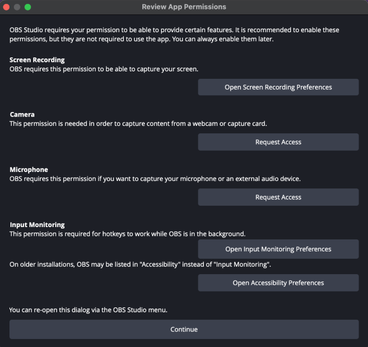
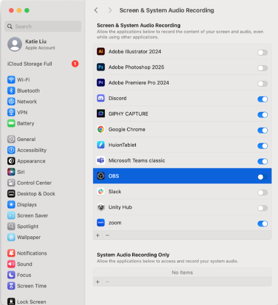
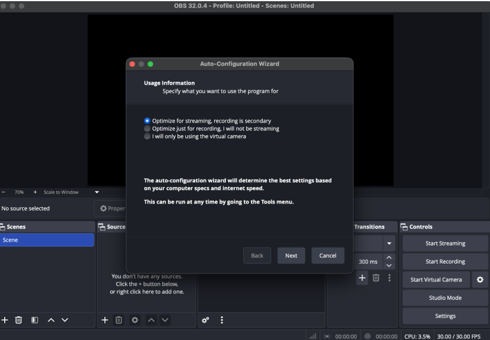

# Overview

If you would like to use SavePoint with OBS as the screen recording tool (recommended), there are a few setup steps you'll need to do. You can watch this [setup video (recorded on Windows; for Mac there are additional setup steps)](https://youtu.be/TRZVO3Lg0XU) or read the instructions below. 

---

## 1. Install OBS

Download OBS from <https://obsproject.com/>. It works on both Windows and Mac.

### Windows

The first time you open OBS, an Auto-Configuration Wizard appears. Select:

> **Optimize just for recording, I will not be streaming**

The rest of the settings can be accepted as default.

### Mac

The first time you open OBS on a Mac, you will see a **Review App Permissions**
window:

Enable **Screen Recording** and **Microphone**. The picture shows them disabled as
an example — click the blue slider to enable them. You can ignore the other
options.

OBS will also ask how you plan to use it. Choose **optimize just for recording**,
as you will not be streaming.

---

## 2. Let the app control OBS

SavePoint starts and stops your recording for you, which it does through a
feature called OBS WebSocket. Without this step, recording will not work.

In OBS:

1. Go to **Tools > WebSocket Server Settings**.
2. Check **Enable WebSocket server**.
3. **Uncheck Enable Authentication.**
4. Make sure the **Server Port** is **4455**.
5. **Press Apply.**

---

## 4. Add your game as a source

This tells OBS which window to record.

1. Open your game in Steam.
2. In OBS, add a **Window Capture** source.
3. Select your Steam game — it should look something like `game.exe`.
4. Check that your game window is showing up correctly in OBS. Use the red
   adjustment bars to fit the game to the frame.

---

## You're ready

Setup is complete. See [Using SavePoint](using-the-app.md) for how to
run a session.

If you have any questions, please reach out.